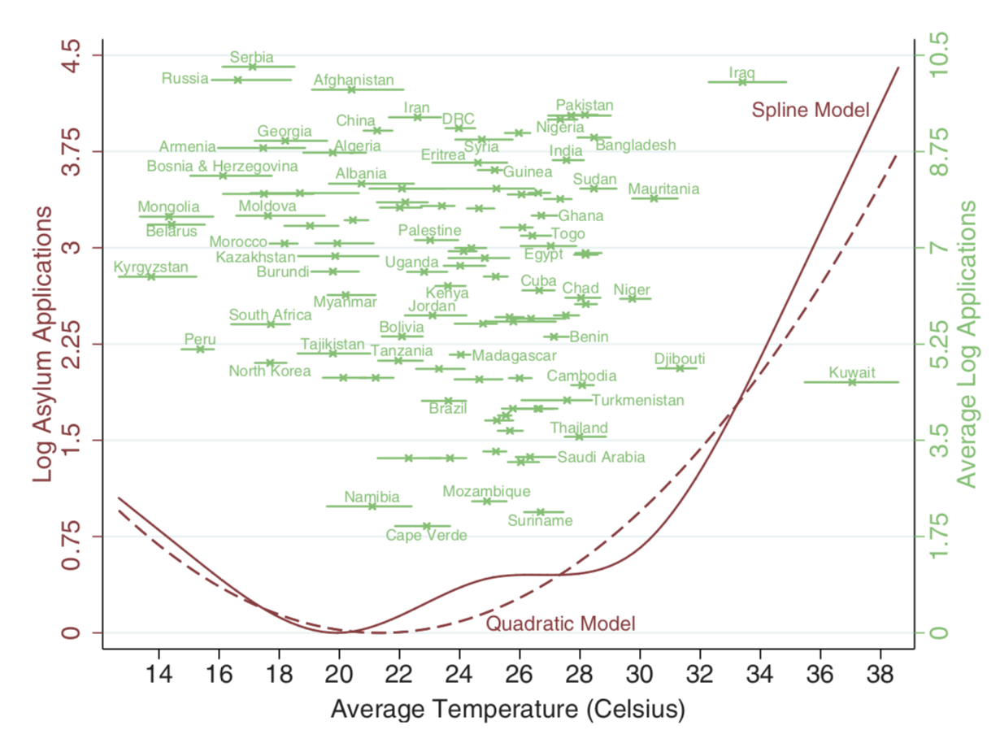

### Summary
We were interested in the green part of Figure 1, which captures the relationship between average temperatures and log asylum applications for each country.  



In this figure, the 'x' marks represent each country's average temperature and average log asylum applications. The horizontal lines represent the range of each country's annual average temperature over the period of study. 

We reproduce this portion of the plot and create an additional plot indicating the range of each country's log asylum applications over the period of study. 

### Load libraries

```{r warning=FALSE}
library(dplyr)
library(readstata13)
library(ggplot2)
library(tidyr)
```

### Load data

```{r}
# loads data from 
baseline <- read.dta13("data/baselineData.dta")
country <- read.dta13("data/countryData.dta")
nex <- read.dta13("data/NEXdata.dta")
climate <- read.dta13("data/uniformClimateChange.dta")
additional <- read.dta13("data/additionalData.dta")
```


```{r}
summary <- baseline %>%
  select(originCountryName, year, applications, tAvgDEL) %>%
  mutate(log_app = log(applications)) %>%
  group_by(originCountryName) %>%
  summarise(min_log_app = min(log_app, na.rm = TRUE),
            mean_log_app = mean(log_app, na.rm = TRUE),
            max_log_app = max(log_app, na.rm = TRUE),
            min_temp = min(tAvgDEL, na.rm = TRUE),
            mean_temp = mean(tAvgDEL, na.rm = TRUE),
            max_temp = max(tAvgDEL, na.rm = TRUE)) %>%
  filter(mean_log_app > 0)
```

```{r, out.width='50%', fig.align='center'}

```
```{r}
summary <- summary %>%
  mutate(app_range = max_log_app - min_log_app)
```
  
Scatter plot with range of temperatures for each country
```{r}
ggplot(summary, aes(x = mean_log_app, y = mean_temp)) + 
  geom_point(shape = 4, color = "green") + 
  geom_errorbar(mapping = aes(x = mean_log_app, ymin = min_temp, ymax = max_temp), size=0.2, color = "green") +
  geom_text(aes(label=originCountryName),hjust=0.1, vjust=-1, size=1.7) +
  coord_flip() +
  theme_bw() +
  scale_y_continuous(name = "Average Temperature (Celsius)", breaks = seq(0,40, 2)) + 
  scale_x_continuous(name = "Average log Applications", breaks = seq(0,15,1.75))
```
Scatter plot with range of log asylum applications for each country
```{r}
ggplot(summary, aes(x = mean_temp, y = mean_log_app)) + 
  geom_point(shape = 4, color = "blue") + 
  geom_errorbar(mapping = aes(x = mean_temp, ymin = min_log_app, ymax = max_log_app), size = 0.2, color = "blue") +
  geom_text(aes(label=originCountryName),hjust=1.4, vjust=0, size=1.7) +
  theme_bw() +
  scale_x_continuous(name = "Average Temperature (Celsius)", breaks = seq(0,40, 2)) + 
  scale_y_continuous(name = "Average log Applications", breaks = seq(0,15,1.75))
```

```{r}
ggplot(summary, aes(x = mean_temp, y = mean_log_app, color = app_range)) + 
  geom_point(shape = 4, size = 2) + 
  theme_bw() +
  scale_x_continuous(name = "Average Temperature (Celsius)", breaks = seq(0,40, 2)) + 
  scale_y_continuous(name = "Average log Applications", breaks = seq(0,15,1.75)) +
  scale_fill_gradientn(colours = terrain.colors(20)) +
  geom_text(aes(label=originCountryName),hjust=0.1, vjust=-1, size=1.7) +
  labs(title = "Average temperature & application scatter plot", subtitle = "(color-coded by application range)", color = "Application \nRange")
```


