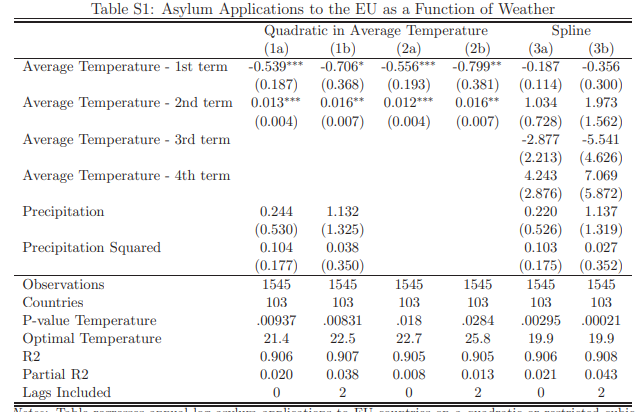

### Summary
We were interested in the green part of Figure 1, which captures the relationship between average temperatures and log asylum applications for each country.  


In this figure, the 'x' marks represent each country's average temperature and average log asylum applications. The horizontal lines represent the range of each country's annual average temperature over the period of study. 

We reproduce this portion of the plot and create an additional plot indicating the range of each country's log asylum applications over the period of study. 

### Load libraries

```{r warning=FALSE}
library(dplyr)
library(readstata13)
library(ggplot2)
library(tidyr)
```

### Load data

```{r}
# loads data from 
baseline <- read.dta13("data/baselineData.dta")
country <- read.dta13("data/countryData.dta")
nex <- read.dta13("data/NEXdata.dta")
climate <- read.dta13("data/uniformClimateChange.dta")
additional <- read.dta13("data/additionalData.dta")
```


```{r}
summary <- baseline %>%
  select(originCountryName, year, applications, tAvgDEL) %>%
  mutate(log_app = log(applications)) %>%
  group_by(originCountryName) %>%
  summarise(min_log_app = min(log_app, na.rm = TRUE),
            mean_log_app = mean(log_app, na.rm = TRUE),
            max_log_app = max(log_app, na.rm = TRUE),
            min_temp = min(tAvgDEL, na.rm = TRUE),
            mean_temp = mean(tAvgDEL, na.rm = TRUE),
            max_temp = max(tAvgDEL, na.rm = TRUE)) %>%
  filter(mean_log_app > 0)
```

```{r}
summary <- summary %>%
  mutate(app_range = max_log_app - min_log_app, temp_range = max_temp - min_temp)
summary
```

Scatter plot with range of temperature for each country
```{r}
ggplot(summary, aes(x = mean_log_app, y = mean_temp)) + 
  geom_point(shape = 4, color = "green") + 
  geom_errorbar(mapping = aes(x = mean_log_app, ymin = min_temp, ymax = max_temp), size=0.2, color = "green") +
  geom_text(aes(label=originCountryName),hjust=0.1, vjust=-1, size=1.7) +
  coord_flip() +
  theme_bw() +
  scale_y_continuous(name = "Average Temperature (Celsius)", breaks = seq(0,40, 2)) + 
  scale_x_continuous(name = "Average log Applications", breaks = seq(0,15,1.75)) +
  labs(title = "Average temperature & application scatter plot", subtitle = "(with errorbars showing the variation in temperature)")
```
Scatter plot with range of log asylum applications for each country
```{r}
ggplot(summary, aes(x = mean_temp, y = mean_log_app)) + 
  geom_point(shape = 4, color = "blue") + 
  geom_errorbar(mapping = aes(x = mean_temp, ymin = min_log_app, ymax = max_log_app), size = 0.2, color = "blue") +
  geom_text(aes(label=originCountryName),hjust=1.4, vjust=0, size=1.7) +
  theme_bw() +
  scale_x_continuous(name = "Average Temperature (Celsius)", breaks = seq(0,40, 2)) + 
  scale_y_continuous(name = "Average log Applications", breaks = seq(0,15,1.75)) +
  labs(title = "Average temperature & application scatter plot", subtitle = "(with errorbars showing the variation in applications")
```
Scatter plot with range of log applications for each country (visualized using colorramp)
```{r}
ggplot(summary, aes(x = mean_temp, y = mean_log_app, color = app_range)) + 
  geom_point(shape = 4, size = 2) + 
  theme_bw() +
  scale_x_continuous(name = "Average Temperature (Celsius)", breaks = seq(0,40, 2)) + 
  scale_y_continuous(name = "Average log Applications", breaks = seq(0,15,1.75)) +
  geom_text(aes(label=originCountryName),hjust=0.1, vjust=-1, size=1.7) +
  labs(title = "Average temperature & application scatter plot", subtitle = "(color-coded by application range)", color = "Application \nRange")
```
Scatter plot with range of temperature for each country (visualized using colorramp)
```{r}
ggplot(summary, aes(x = mean_temp, y = mean_log_app, color = temp_range)) + 
  geom_point(shape = 4, size = 2) + 
  theme_bw() +
  scale_x_continuous(name = "Average Temperature (Celsius)", breaks = seq(0,40, 2)) + 
  scale_y_continuous(name = "Average log Applications", breaks = seq(0,15,1.75)) +
  geom_text(aes(label=originCountryName),hjust=0.1, vjust=-1, size=1.7) +
  labs(title = "Average temperature & application scatter plot", subtitle = "(color-coded by application range)", color = "Temperature \nRange")
```
Exploring the relationship between average temperature and application normalized using total population.
```{r}
merged <- left_join(baseline, country, by="originCodeISO") 
summary2 <- merged %>% 
  select(originCountryName, year, applications, tAvgDEL, population) %>%
  mutate(log_app = log(applications)) %>%
  group_by(originCountryName) %>%
  summarise(min_log_app = min(log_app, na.rm = TRUE),
            mean_log_app = mean(log_app, na.rm = TRUE),
            max_log_app = max(log_app, na.rm = TRUE),
            min_temp = min(tAvgDEL, na.rm = TRUE),
            mean_temp = mean(tAvgDEL, na.rm = TRUE),
            max_temp = max(tAvgDEL, na.rm = TRUE),
            population = max(population, na.rm = TRUE)) %>%
  filter(mean_log_app > 0, population > 0)
## new attempt at graph
```
```{r}
summary2 <- summary2 %>%
  mutate(norm_range = max_log_app/population - min_log_app/population)
summary2
```
```{r}
ggplot(summary2, aes(x = mean_temp, y = mean_log_app/population, color = norm_range)) + 
  geom_point(shape = 4) + 
  geom_errorbar(mapping = aes(x = mean_temp, ymin = min_log_app/population, ymax = max_log_app/population)) +
  theme_bw() +
  geom_text(aes(label=originCountryName),hjust=-0.2, vjust=0, size=2.2) +
  scale_x_continuous(name = "Average Temperature (Celsius)", breaks = seq(0,40, 2)) +
  scale_y_continuous(name = "Mean log Application / Population") +
  labs(title = "Average temperature & normalized application scatter plot", subtitle = "(color-coded by normalized application range)", color = "Application \n(normalized) \nRange")
```

Trying to replicate the quadratic and spline models
```{r, out.width='50%', fig.align='center'}

```

Quadratic and spline fit  
Unable to explain the negative values

```{r}
baseline2 <- baseline %>%
  mutate(log_assylum_quad = (tAvgDEL*-0.539)+(tAvgDEL2*0.013)+(precDEL*0.244)+(precDEL2*0.104)) %>%
  mutate(log_assylum_spline = (tSplineDEL1*-0.187)+(tSplineDEL2*1.034)+(tSplineDEL3*-2.877)+(tSplineDEL4*4.243)+(precDEL*0.220)+(precDEL2*0.103)) %>%
  mutate(log_applications = log(applications)) %>%
  select(log_applications, log_assylum_quad, log_assylum_spline)

head(baseline2)
```


